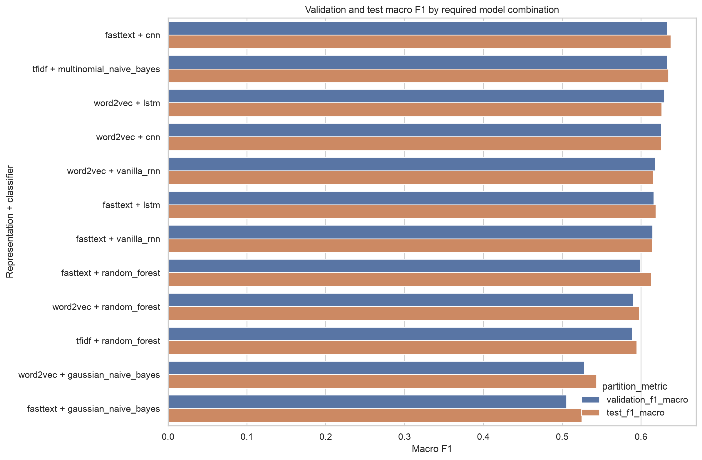
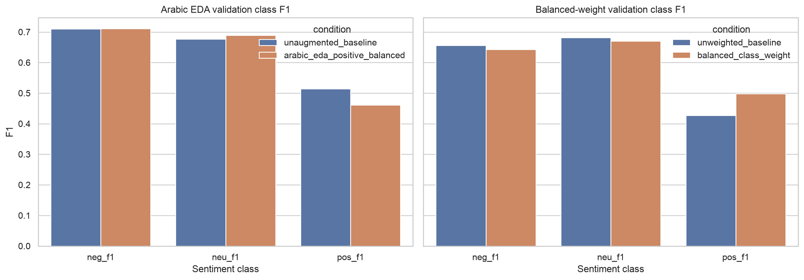
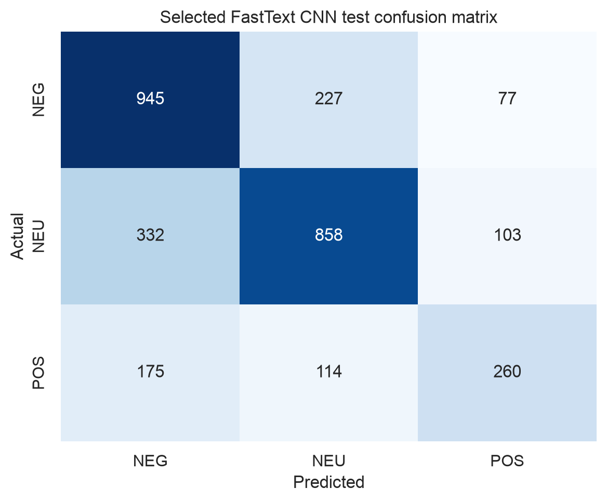

# Arabic Sentiment Analysis with ArSarcasm-v2

A reproducible, notebook-first study of three-class Arabic sentiment analysis
for ENCS5141 AI Lab Assignment 2. The project compares TF-IDF, Word2Vec, and
FastText representations across traditional and neural classifiers, then
evaluates preprocessing, data augmentation, and class-imbalance handling.

The primary executable deliverable is
[`notebooks/arabic_sentiment_analysis.ipynb`](notebooks/arabic_sentiment_analysis.ipynb).
It contains the complete workflow from verified dataset acquisition through
the final test evaluation and generation of report-ready artifacts.

## Study scope

- Sentiment targets: negative (`NEG`), neutral (`NEU`), and positive (`POS`)
- Representations: TF-IDF, Word2Vec, and FastText
- Classifiers: Multinomial/Gaussian Naive Bayes, Random Forest, CNN, vanilla
  RNN, and LSTM
- Selection metric: validation macro F1
- Final stability seeds: 42, 1337, and 2026
- Auxiliary analyses: sarcasm and dialect error patterns

TF-IDF is evaluated with Multinomial Naive Bayes and Random Forest. It is not
paired with CNN, RNN, or LSTM because sparse vocabulary dimensions are not an
ordered linguistic sequence. Word2Vec and FastText are each evaluated with
Gaussian Naive Bayes, Random Forest, CNN, vanilla RNN, and LSTM, producing the
12 required model combinations.

## Dataset and leakage controls

The notebook downloads the official
[ArSarcasm-v2](https://github.com/iabufarha/ArSarcasm-v2) training and testing
files from pinned revision
`eb85513e133cfc67e30aca4968fadbe2594fcb42`, then verifies their SHA-256
checksums before use. The raw files contain 15,548 labeled records in total.

The original source partitions are combined and rebuilt into a deterministic
60/20/20 train/validation/test split. Before splitting:

- all 52 rows in 26 normalized-text groups with conflicting sentiment labels
  are removed;
- remaining normalized duplicates are collapsed deterministically;
- the resulting 15,455 records are grouped by their complete processed text;
- equivalent model inputs are kept within one partition.

The final split contains 9,273 training, 3,091 validation, and 3,091 test
records. Preprocessing resources, feature extractors, embeddings,
augmentation, and class weights use training data only. Validation data is
used for tuning and model selection, and the test partition is evaluated only
after every configuration is frozen.

Raw and processed datasets are intentionally excluded from Git. The notebook
downloads and regenerates them when executed.

## Arabic preprocessing

The configurable pipeline:

- removes markup, URLs, and transport noise;
- replaces mentions and normalizes numbers with protected placeholders;
- converts emoji to semantic tokens instead of deleting them;
- retains hashtag content;
- normalizes conservative Arabic character variants, diacritics, tatweel,
  punctuation, and repeated characters;
- uses NLTK Arabic stop words and Qalsadi lemmatization by default;
- protects negations, emoji tokens, hashtags, mentions, and placeholders from
  inappropriate removal or morphological reduction.

ISRI stemming remains available in the configuration but is disabled by
default. Each enabled preprocessing stage is evaluated independently in the
ablation study.

## Final results

The FastText CNN was selected using validation macro F1 before any test
predictions were generated. At seed 42 it achieved **0.6380 test macro F1**
and **0.6674 test accuracy**.

| Validation rank | Representation + classifier | Validation macro F1 | Test macro F1 | Test accuracy | Test POS F1 |
|---:|---|---:|---:|---:|---:|
| 1 | FastText + CNN | 0.6335 | **0.6380** | 0.6674 | **0.5258** |
| 2 | TF-IDF + Multinomial NB | 0.6335 | 0.6348 | 0.6671 | 0.5088 |
| 3 | Word2Vec + LSTM | 0.6296 | 0.6262 | 0.6555 | 0.5117 |
| 4 | Word2Vec + CNN | 0.6256 | 0.6254 | 0.6622 | 0.4919 |
| 5 | Word2Vec + vanilla RNN | 0.6177 | 0.6156 | 0.6454 | 0.5005 |
| 6 | FastText + LSTM | 0.6164 | 0.6189 | 0.6522 | 0.4943 |
| 7 | FastText + vanilla RNN | 0.6149 | 0.6139 | 0.6509 | 0.4742 |
| 8 | FastText + Random Forest | 0.5986 | 0.6128 | 0.6707 | 0.4253 |
| 9 | Word2Vec + Random Forest | 0.5900 | 0.5978 | 0.6587 | 0.3990 |
| 10 | TF-IDF + Random Forest | 0.5886 | 0.5948 | 0.6457 | 0.4282 |
| 11 | Word2Vec + Gaussian NB | 0.5279 | 0.5435 | 0.5804 | 0.4378 |
| 12 | FastText + Gaussian NB | 0.5054 | 0.5248 | 0.5675 | 0.4207 |

Across the three prespecified seeds, the selected FastText CNN produced a test
macro F1 of **0.6103 ± 0.0247**. The seed-level values are retained rather
than replacing the validation-selected seed-42 result.



### Controlled studies

- **Preprocessing ablation:** emoji demojization and hashtag unpacking had the
  largest positive contribution to validation macro F1. Disabling them reduced
  macro F1 by 0.0131 and 0.0058, respectively.
- **Arabic EDA augmentation:** balancing the positive class with protected
  random swaps and deletions reduced macro F1 from 0.6335 to 0.6207 and
  positive-class F1 from 0.5138 to 0.4612.
- **Class weighting:** balanced weights improved the controlled TF-IDF Random
  Forest macro F1 from 0.5886 to 0.6037 and positive-class F1 from 0.4275 to
  0.4978.



The selected model's test confusion matrix shows that positive sentiment
remains the hardest class. Sarcasm and dialect results are descriptive only;
the Maghrebi test subgroup contains just eight records and should not support
strong conclusions.



## Reproducing the notebook

### Requirements

- Python 3.12
- [uv](https://docs.astral.sh/uv/)
- Internet access for the first verified dataset download

Apple MPS is used automatically when available; otherwise the notebook falls
back to CPU. The experiment configuration uses deterministic PyTorch
algorithms where supported.

### Setup

```bash
git clone https://github.com/iAboud98/arabic-sentiment-analysis.git
cd arabic-sentiment-analysis
uv sync --dev
```

For interactive use:

```bash
uv run jupyter lab notebooks/arabic_sentiment_analysis.ipynb
```

To execute the complete notebook in place while keeping notebook files stable
across repeat runs:

```bash
uv run jupyter nbconvert \
  --to notebook \
  --execute \
  --inplace notebooks/arabic_sentiment_analysis.ipynb \
  --ExecutePreprocessor.timeout=7200 \
  --ExecutePreprocessor.record_timing=False
```

The notebook may be launched from either the repository root or the
`notebooks/` directory; it locates the project root through `pyproject.toml`.

## Repository layout

```text
.
├── AI lab Second Assignment.pdf       # Assignment specification
├── configs/
│   └── default.yaml                   # Split, preprocessing, model, and study settings
├── notebooks/
│   └── arabic_sentiment_analysis.ipynb
├── reports/
│   ├── figures/                       # Generated report-ready PNG figures
│   └── tables/                        # Generated report-ready CSV tables
├── results/
│   ├── experiments/                   # Ablation, augmentation, and weighting studies
│   ├── final/                         # Frozen test results and error analyses
│   ├── tuning/                        # Validation search histories
│   └── validation/                    # Selected validation configurations
├── pyproject.toml
└── uv.lock
```

The ignored `data/` and `artifacts/` directories are regenerated locally.
Machine-readable files under `results/` are the source of truth for every
reported number; report tables and figures are produced from those files by
the notebook rather than copied manually.

## Configuration and outputs

[`configs/default.yaml`](configs/default.yaml) defines the split, preprocessing
switches, feature settings, hyperparameter grids, runtime behavior, controlled
experiments, and evaluation seeds.

Useful outputs include:

- [`results/final/model_comparison.csv`](results/final/model_comparison.csv):
  validation and test metrics for all 12 required models;
- [`results/final/test_metrics.json`](results/final/test_metrics.json):
  aggregate, per-class, and confusion-matrix test results;
- [`results/final/selected_model_seed_metrics.csv`](results/final/selected_model_seed_metrics.csv):
  seed-level stability results;
- [`results/experiments/preprocessing_ablation.csv`](results/experiments/preprocessing_ablation.csv):
  one-stage-at-a-time ablation results;
- [`results/experiments/augmentation_comparison.csv`](results/experiments/augmentation_comparison.csv)
  and
  [`results/experiments/class_weight_comparison.csv`](results/experiments/class_weight_comparison.csv):
  controlled imbalance studies;
- [`reports/tables/`](reports/tables/) and
  [`reports/figures/`](reports/figures/): report-ready artifacts.
